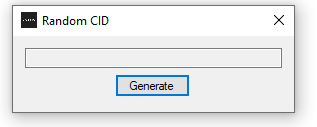

# Random-Content-ID
This will generate a random content ID, manly useful for the PS4.

          

This will generate a random Content-ID for games/homebrew/themes

Q: HOW DO I USE THIS?!??!

A: open it, press generate and copy the content ID into orbis-pub-sfo.exe add the name of the applacation in title tex than save the sfo in sce_sys than open orbis-pub-gen.exe add it to the content ID under settings and done.

Q: Will this work on retail firmware?

A: No

Q: why is this useful?

A: it could reduce the time of creating your own, or it could make it where you don't end up using one used by someone else.

Q:...

A:...
